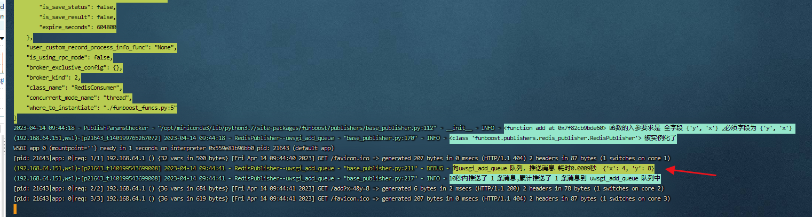
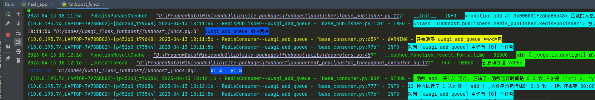

# uwsgi + flask + funboost demo演示，部署应该分为两两次部署


# 1 启动消费  
```
cd 到当前项目根目录 uwsgi_flask_funboost
export pythonpath=./

python funboost_funcs.py  # 第一次运行funboost会在项目根目录下生成配置文件 funboost_config.py ，按需修改配置文件的中间件配置。
```

# 2 uwsgi 启动flask web

```
cd 到当前项目根目录 uwsgi_flask_funboost
export pythonpath=./     # 这一步重要，去看 pythonpathdemo  项目 https://github.com/ydf0509/pythonpathdemo

uwsgi --ini uwsgi_conf.ini   

```

# 3 测试url请求

```
在王子中打开  http://192.168.64.151:8011/add?x=4&y=8    # ip是部署uwsgi的服务器的up 端口是uwsgi中配置的端口
```

可以看到接口中发布x=4 y=8 到消息队列中， 后台消费进程会从消息队列中拉取消息运行 4+8

接口中推送消息截图


后台消费消息截图
